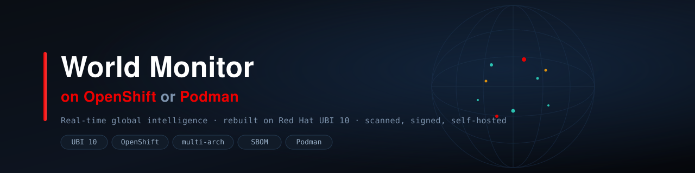

<p align="center">
  
</p>

<p align="center">
  <a href="https://github.com/ryannix123/worldmonitor-on-openshift/actions/workflows/build.yml">
    </a>
  
  
  
  
  
  
</p>

# World Monitor on OpenShift

Run a live, real-time global intelligence platform on your own cluster —
built on Red Hat UBI, published through a security-scanned pipeline, and
deployed with a single command.

[World Monitor](https://github.com/koala73/worldmonitor) turns public data —
markets, trade, conflict, energy, infrastructure, aviation, maritime, and 500+
news feeds — into a live operating picture of the world. A dark map, live
tickers, chokepoint analysis, vessel and flight tracking, AI-assisted briefs.
It's the kind of dashboard people reach for "open-source Palantir" to describe,
though [its author pushes back on that](https://www.worldmonitor.app/blog/posts/worldmonitor-is-not-palantir/):
Palantir makes *your institution's private data* operational; World Monitor
assembles *the public world's data* and shows its own cracks in the open. This
repo is about running that second thing, well, on infrastructure you control.

**What this repo adds:** the upstream project ships as an Alpine container aimed
at Vercel and Railway. This repo rebuilds it the way you'd run it in an
enterprise — on Red Hat's UBI 10 base images, hardened for OpenShift's
`restricted-v2` security context, built by a multi-arch CI pipeline that
generates SBOMs and gates on vulnerabilities, and deployed through Kustomize
overlays with one command.

So there are two halves:

1. **Build** — a nightly multi-arch (amd64 + arm64) pipeline that rebuilds both
   the app and its data relay on UBI 10, generates SPDX SBOMs, scans with Grype,
   fails the build on Critical CVEs, and publishes to Quay.
2. **Deploy** — Kustomize overlays for OpenShift Developer Sandbox (free tier),
   Single Node OpenShift with a GPU for local LLM inference, or plain Podman on
   a laptop. One script, namespace-portable, with a teardown path.

The result: the same live intelligence platform — vessels moving on the map,
chokepoint flows, conflict zones, market data, all seeding through Redis — but
running on images you built, scanned, and can audit end to end.

## Engineering highlights

The interesting parts aren't "it runs" — it's *how* it was made to run safely
and repeatably:

- **UBI 10, not Alpine.** Both images rebuilt on Red Hat's supported base
  (`ubi10/nodejs-24`, `ubi-minimal`), matching the app's Node 24 requirement
  with no version compromise.
- **No init system.** The upstream image runs supervisord to babysit nginx and a
  Node sidecar. This replaces it with a 40-line signal-handling shell entrypoint
  — smaller image, fewer CVEs, and a documented reason (`exec nginx` as PID 1
  silently orphans the sidecar on shutdown; the shell stays PID 1 instead).
- **Arbitrary-UID clean.** Runs under OpenShift's `restricted-v2` SCC with no
  privileged access — group-0 ownership, no baked-in root.
- **A real security supply chain.** Multi-arch build, SPDX SBOM per image, Grype
  scan, `--fail-on critical`. When the pipeline hit a genuine CVSS 9.2 in a
  transitive dependency, it *failed the build* — and the fix was a documented
  [VEX not-affected assessment](#on-the-cve-story), not a suppressed warning or
  a lowered gate.
- **Namespace-portable deploy.** Nothing hardcodes a namespace; the same
  overlays run on any cluster the current `oc` context points at, from a free
  Developer Sandbox to a GPU-equipped Single Node OpenShift.
- **Claude wired in.** Live LLM-assisted briefs via OpenRouter, with a preflight
  that verifies the model is actually reachable rather than silently falling back.

---

## 🆓 Red Hat Developer Sandbox

The [Red Hat Developer Sandbox](https://developers.redhat.com/developer-sandbox) is a **free** OpenShift environment perfect for testing Nextcloud:

- **Free tier** — No credit card required, no setup, no cluster to install
- **Generous resources** — 3 CPU cores, 14 GB RAM, and 40 GB storage per user — plenty to run this entire stack
- **Latest OpenShift** — Always running a recent version (4.18+)
- **Auto-hibernation** — Deployments scale to zero after 12 hours of inactivity

> 💡 **New to OpenShift?** The Sandbox is the fastest way to try the platform — you get a real, current OpenShift cluster in your browser in minutes, with zero install. This entire Nextcloud stack is designed to deploy there on the free tier. [Grab a free Sandbox](https://developers.redhat.com/developer-sandbox) and run `sh deploy.sh`.

Confirm your own namespace's quota at any time:

```bash
oc describe resourcequota
```

### Waking Up Your Deployment

When you return after the sandbox has hibernated, your pods will be scaled down. Run this command to bring everything back up:

```bash
# Scale all deployments back to 1 replica
oc scale deployment --all --replicas=1

# Or specify your namespace explicitly
oc scale deployment --all --replicas=1 -n $(oc project -q)
```

Your data persists in the PVCs — only the pods are stopped during hibernation.

---

## Layout

```
.github/workflows/   Nightly multi-arch build + weekly upstream-sync PR
ci/                  Scan-summary helper for the build
containers/          Containerfile.ubi10 + entrypoint (the image)
upstream.env         Pinned upstream commit SHA

base/                Kustomize base: 4 Deployments, Route, NetworkPolicy
addons/builds/       BuildConfigs + ImageStreams (in-cluster build path only)
overlays/
  sandbox/           Developer Sandbox, builds in-cluster
  sandbox-quay/      Developer Sandbox, pulls the prebuilt Quay image
  sno/               Single Node OpenShift, GPU Ollama for local LLM
deploy.sh            One-shot deploy: ./deploy.sh -o <overlay> -E OPENROUTER_API_KEY
podman/              Apple Silicon local-run path
```

## Two ways to get the image onto a cluster

**Prebuilt from Quay (recommended for demos).** CI has already built it; the
overlay just pulls it. Fastest, and the same artifact every time.

```bash
oc login --token=... --server=https://api.sandbox-....openshiftapps.com:6443
./deploy.sh -o overlays/sandbox-quay -E OPENROUTER_API_KEY
```

**Build in-cluster.** No external registry needed; OpenShift builds from source
in ~5 minutes. Useful on SNO or when you want everything self-contained.

```bash
./deploy.sh -o overlays/sandbox -E OPENROUTER_API_KEY   # or overlays/sno
```

`-E` prompts for the key without echoing. Use `-e KEY=VALUE` for the inline
form, or omit both to deploy without AI features. See `overlays/*/README.md` for
per-target detail.

## Data source API keys

Every key is optional and every panel degrades gracefully without one. Pass
them at deploy time with `-E KEY` (prompts, no echo) or `-e KEY=VALUE`:

```bash
./deploy.sh -o overlays/sandbox-quay \
  -E OPENROUTER_API_KEY \
  -E AISSTREAM_API_KEY \
  -E UCDP_ACCESS_TOKEN
```

They land in `overlays/<target>/secrets/apikeys.env`, which is gitignored and
becomes the `worldmonitor-apikeys` Secret. Both the app and the relay mount it
via `envFrom`, so a key added here reaches whichever process needs it.

### UCDP — armed conflict events

`UCDP_ACCESS_TOKEN` feeds the ARMED CONFLICT EVENTS panel and the conflict floor
in the Country Instability Index. Without it that panel sits at zero and CII
reports `degraded`.

The Uppsala Conflict Data Program publishes a free REST API at
`ucdpapi.pcr.uu.se`, documented at <https://ucdp.uu.se/apidocs/>. Anonymous
access works but is capped: 5,000 requests per day, 1,000 rows per page, and
paging is mandatory — a full Georeferenced Event Dataset pull is ~418 pages, so
a handful of seed cycles will exhaust the daily quota. A free access token
lifts both the paging requirement and the download limit, which is what you
want for anything that re-seeds on a loop. Request one from the API maintainer
(`ucdp@pcr.uu.se`); the apidocs page has the current process.

UCDP sends the token as an `x-ucdp-access-token` header rather than a bearer
token. The relay handles that — `scripts/ais-relay.cjs` reads
`UCDP_ACCESS_TOKEN` (falling back to `UC_DP_KEY`) and sets the header itself.
Nothing to configure beyond the deploy flag.

Confirm it took after deploying:

```bash
oc logs deploy/ais-relay | grep -i ucdp
# [UCDP] Version 26.1, 418 total pages
# [UCDP] Seeded 2000 events (raw: 5968, failed pages: 0, redis: OK)
```

`failed pages: 0` means the token authenticated. `redis: OK` means the write
landed — a `redis: FAIL` there points at the cache proxy, not at UCDP.

### ACLED — conflict events (second source)

`ACLED_EMAIL` and `ACLED_PASSWORD` cover the same panel family from a different
source. ACLED registration is at <https://acleddata.com/>. Note that ACLED has
moved auth models more than once; if the relay logs `ACLED API error: 403`,
check whether your account now needs an API key rather than email and password.

## The image

`containers/Containerfile.ubi10` rebuilds upstream's Alpine image on
`ubi10/ubi-minimal` + `nodejs24`, replaces supervisord with a shell entrypoint,
and supports OpenShift's arbitrary UID. `.nvmrc` pins Node 24 and `ubi10/nodejs-24`
is GA, so there was no version compromise.

It stays a **single container** deliberately: nginx and the Node sidecar share a
per-start random `LOCAL_API_TOKEN`, and splitting them would force that into a
long-lived Secret. See `containers/` and the note in the CI section below.

### Why no supervisord / s6 / tini

Two processes, one of which exists only to serve static files and proxy `/api/`.
The entrypoint runs them as shell-managed children: `wait -n` exits with
whichever dies first, SIGTERM is forwarded to both. Note that `exec nginx` as
PID 1 was tried and rejected — it discards the trap and orphans the sidecar on
shutdown. The shell stays PID 1 for correct signal handling.

## CI

Nightly at 07:00 UTC (02:00 CDT), plus on push and manual dispatch:

- Resolves one upstream SHA for the whole run, so amd64 and arm64 build
  identical source
- Builds both arches, smoke-tests amd64 (health endpoint, SPA fallback,
  non-root UID), assembles a manifest list
- Syft SBOM + Grype scan, `--fail-on critical` only, results in the run summary
- Builds the relay image the same way (`build-relay` job,
  `Containerfile.ubi10-relay`)
- Pushes both `<sha>` and `latest` to `quay.io/ryan_nix/worldmonitor-openshift`
  and `quay.io/ryan_nix/worldmonitor-ais-relay`

`upstream-sync.yml` opens a bump PR every Monday, since upstream ships from
`main` and stopped tagging ~5 months ago. It flags changes to build-relevant
files so a bump is reviewed, not blindly merged.

### CI secrets

| Secret | Purpose |
|---|---|
| `QUAY_USERNAME` | Quay robot account, e.g. `ryan_nix+worldmonitor_ci` |
| `QUAY_PASSWORD` | That robot's token (needs Write on the repo) |

## Wiring Claude

The app has no Anthropic provider — its LLM layer speaks OpenAI-compatible,
`groq`, `openrouter`, or `ollama`. OpenRouter is the route to Claude, and the
overlays set the model routing. Before relying on it, run
`scripts/verify-openrouter.sh` (in the deploy bundle) to confirm the app's
forced provider-routing constant doesn't exclude Anthropic models. See any
overlay's notes for the profile/model detail.

## Cost note

Upstream caps AviationStack spend but has no LLM ceiling, and the seeders run on
cron across 500+ feeds. The overlays enable `USAGE_TELEMETRY` and leave the
fan-out pipelines (`AI_DIGEST_ENABLED`, `BRIEF_COMPOSE_ENABLED`) off. Prepay a
small OpenRouter balance and enable pipelines one at a time.


## Self-hosting fixes in this repo

Three gaps that stop a self-hosted deployment from working, none of them
documented upstream. Each is fixed here and verified against a running cluster:

**1. Hardcoded production RPC URLs.** The relay's warm-ping and RPC targets are
string constants pointing at `api.worldmonitor.app` with no env override, so a
self-hosted relay authenticates against upstream's production gateway and 401s.
Fixed with a fetch-layer preload (`WM_INTERNAL_API_BASE`) that rewrites the
origin — see `containers/Containerfile.ubi10-relay`.

**2. Undocumented auth requirements.** Key-gated endpoints need
`WORLDMONITOR_VALID_KEYS` on the app (allowlisting the relay's
`X-WorldMonitor-Key`) and `WM_SESSION_SECRET` so the app can mint browser
sessions. Without the latter, every browser request to a gated endpoint returns
401 "API key required" and the panels render UNAVAILABLE even though the API
computes the data correctly. Both are generated by `deploy.sh`.

**3. SRH path-style GET incompatibility.** `readCachedJson()` reads Redis with
`GET ${UPSTASH_REDIS_REST_URL}/get/<key>`. Upstash's hosted API serves that;
`hiett/serverless-redis-http`, the usual self-hosted stand-in, implements only
the POST-command forms and 404s every path-style route. The 404 is treated as a
cache miss, so Redis-backed panels show "no data" while the data sits in Redis
— Security Advisories had 219 records stored and displayed 0, and UCDP had
2,000 events in a 757 KB key while the panel read `{"events":[]}`.

The failure is near-silent by design: the handlers catch and return an empty
result rather than an error, and the only log line is a bare
`[redis] getCachedJson failed: Redis HTTP 404` with no key name. Everything
downstream looks healthy — the seed loops report `redis: OK` because writes use
the POST form, which SRH does implement.

A `--require` preload shim on the app image was the first attempt and is not
enough: it patches `globalThis.fetch`, but the API handlers are loaded through
`await import()` and resolve `fetch` as an ES module binding the patch never
reaches. The working fix is to stop using SRH. Upstream ships its own proxy at
`docker/redis-rest-proxy.mjs`, which handles `GET /{cmd}/{args}`, `POST /`,
`POST /pipeline` and `POST /multi-exec` — the full set the app uses.
`containers/Containerfile.redis-rest` rebuilds it on UBI 10 (upstream's
Dockerfile uses `node:24-alpine` and runs as root, which restricted SCC
rejects), CI publishes it, and `base/redis-rest.yaml` points at it.

The first and third are one-line upstream fixes (make the constants
configurable; use the POST form or document the SRH requirement) and are worth
upstreaming.
